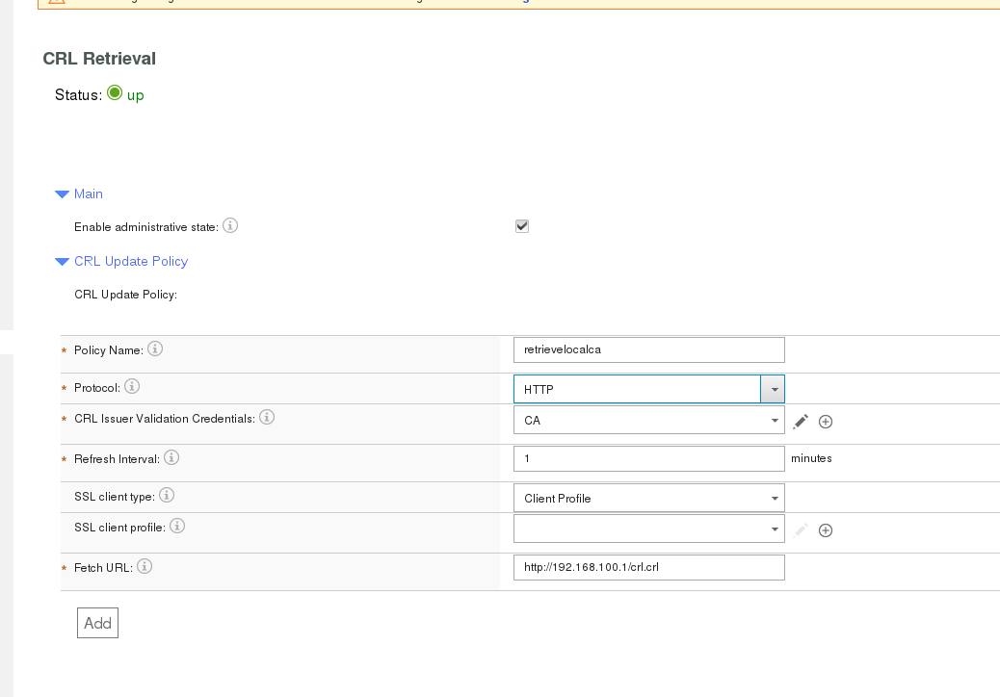
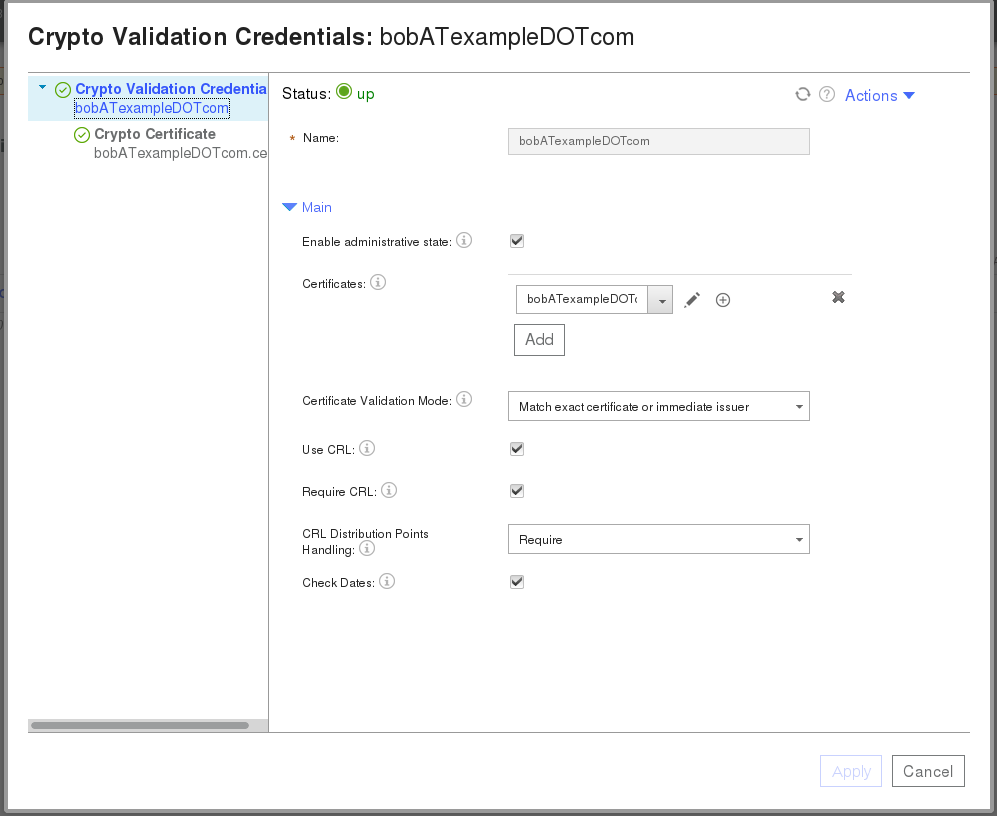

#CRLs and OCSP in DataPower
##Introduction

The one way to make sure that certificates we used are to be trusted is to validate if the certificates haven't been revoked. This is done by checking a CRL (Certificate Revocation List) or utilized OCSP (Online Certificate Status Protocol). This blog mainly covers the support of CRL, it will quickly provides pointer to the OCSP support on the DataPower gateway.   Most certificates contains an extention which describe the endpoint to acquire the CRL, which is issued by the CA that signed this certificate.

If a CA revokes a certificate, the certificate is  is added to the CRL, and the clients/applications  check this CRL, to determine whether  the certificate, although being in the trust-store, is not to be trusted, because the certificate has been revoked

DataPower supports CRLs in DER or PEM format and can fetch them from an LDAP, HTTP source that might or might not be secure by SSL/TLS

##Hands on
###CRLs

On DataPower this is a 2 step process
Step 1:
In the default domain we must define a CRL retrieval policy for the CRL endpoint, For every certificate that we want to verify against the CRL the endpoint must have a corresponding CRL endpoint policy.

Policy Name: a name given to this specific retrieval rule
Protocol: The protocol that is used to fetch the CRL, it can be HTTP or LDAP (when you have an HTTPS endpoint select HTTP and fill in the SSL client type)
CRL Issuer Validation Credentials: The certificate that is used to validate the signature of the CRL
Refresh Interval: The interval use to poll the CRL endpoint.
SSL Client type: This can be a Client Profile or a Proxy Profile (deprecated)
SSL client profile / Cryptographic Profile (deprecated): The client profile to connect to SSL/TLS secured endpoint
Fetch URL: The CRL endpoint as defined in the certificate extensions that you want to have validated

In case of an LDAP endpoint the Fetch URL is replaced by variables to the define the location of the CRL on LDAP as shown below

Now that we have defined the CRL endpoint update policy. We can use this CRL to verify if certificates that have this CRL endpoint defined in the extension hasn't been revoked

Step 2:
In the domain where we want to use the certificate, the settings for the CRL are found in the validation credentials

Use CRL: Tells us if we are going to make use of the CRL
Require CRL: The validation of the certificate fails if there is no copy of the CRL in the CRL cache.
CRL Distribution Points Handling:
- Require all the CRL distribution points in the certificate are checked against (however they must be fetched by a CRL update policy). If any CRL is nog longer in the CRL cache the calidataion fails.
- Ignore Ignore the certificate extension, if present. However the certificate is till checked agaisnt the CRLs in the cache.

For the  CRL distribution points in the certificate extension there should be a retrieval policy if checking is enforced if not and the CRL is not fetched we will see an error stating that the CRL endpoint is not available

###OCSP

As an alternative to CRLs  RFC 6960 OCSP was introduced as more lightweight alternative.
DataPower has 2 cryptographic extensions to verify the validity of a certificate

ocsp-validate-certificate()
Makes an OCSP (Online Certificate Status Protocol) request to an OCSP server, validates the server response, and returns an XML representation of the response.

ocsp-validate-response()
Revalidates a response that was previously obtained from an OCSP server, and returns an XML representation of the response. The previously obtained response was with the ocsp-validate-certificate() function.
