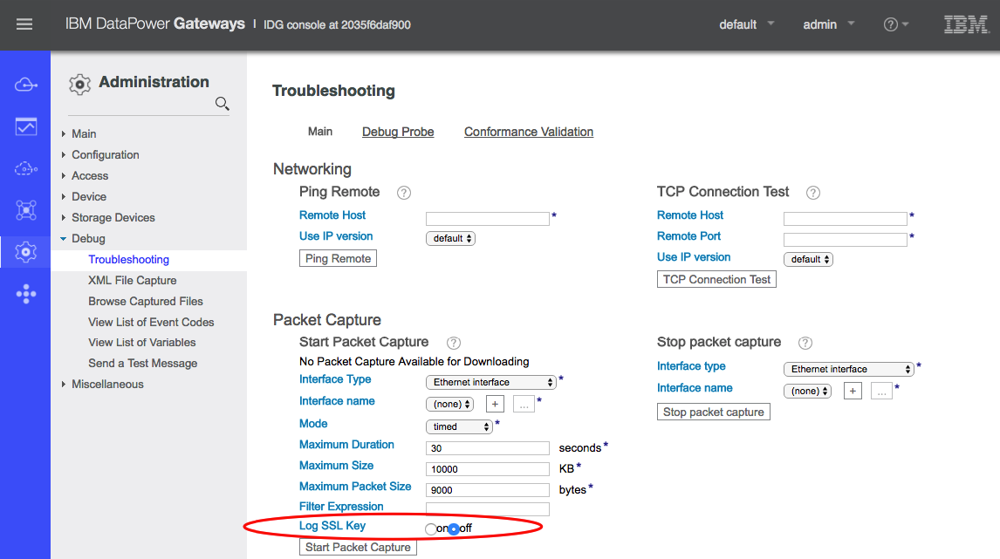
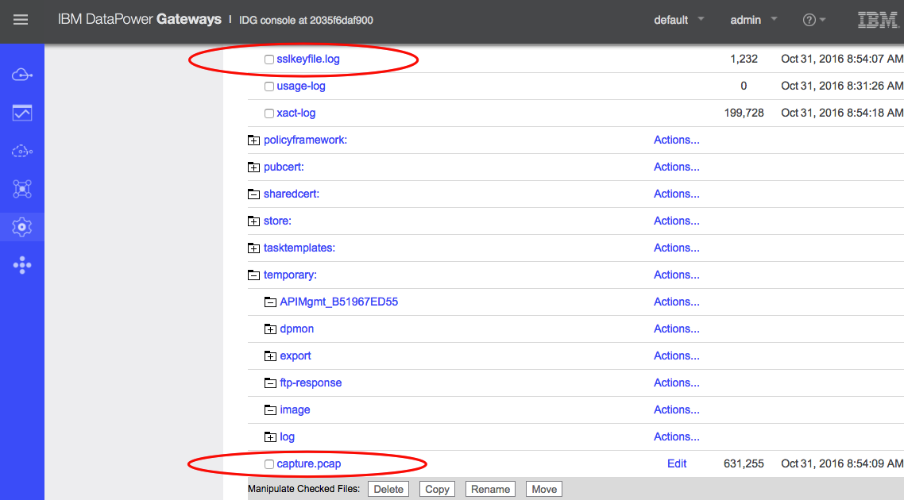
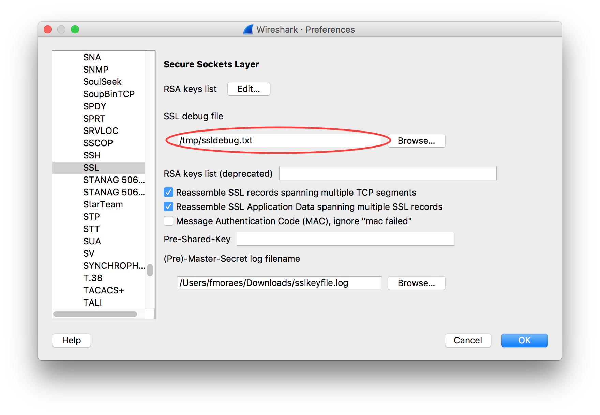
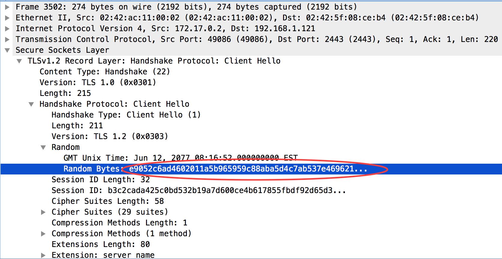

## Decrypt DataPower TLS/SSL traffic using master secret logging

Using TLS/SSL everywhere is more than a best practice, its a necessity. This can often make debugging network level problems more difficult and require the sharing of private key information.

With DataPower 7.5.2 we added a new feature to log the session master secret, which can be used in combination with Wireshark to decrypt the TLS/SSL traffic without having to copy the private key to the system running Wireshark.

System administrators have the option to enable this feature when starting a network packet capture:



Once the packet capture is started the system will begin logging the private master secret information to logtemp:///sslkeyfile.log

Stop the packet capture and copy logtemp:///sslkeyfile.log and temporary:///capture.pcap to a system running Wireshark:

Open Wireshark and from the menu select “Preferences -> Protocols -> SSL”. In the (Pre)-Master-Secret log filename input, specify the location of the sslkeyfile.log copied from DataPower:

If you're using a non-standard port for HTTPS, update “Preferences -> Protocols -> HTTP” as shown below:

Now load the packet capture file using "File -> Open" to see that the TLS sessions containing a complete TLS handshake are now decrypted automatically.

## Troubleshooting

If packets are not decrypting properly, you can enable a debug output file under "Preferences -> Protocols -> SSL":

Note: only sessions that have captured the full SSL keyexchange consisting of CLIENT_HELLO and SERVER_HELLO can be properly decrypted.

## Limiting the scope of the result

The sslkeyfile.log will contain the master secret for all sessions inbound and outbound from DataPower. If you need to limit the scope of the information given to a third-party for debugging, you can only copy a subset of the lines from the file. This will only allow the chosen sessions to be decrypted by the third party.

In order to do this, find the CLIENT_HELLO frames of the sessions of interest in Wireshark and match the Random bytes to the lines in the sslkeyfile.log.

## Reference

* [NSS Key Log format](https://developer.mozilla.org/en-US/docs/Mozilla/Projects/NSS/Key_Log_Format)
* [Decrypting TLS Browser Traffic With Wireshark – The Easy Way!](https://jimshaver.net/2015/02/11/decrypting-tls-browser-traffic-with-wireshark-the-easy-way/)
* [Psst. Your Browser Knows All Your Secrets](https://isc.sans.edu/forums/diary/Psst+Your+Browser+Knows+All+Your+Secrets/16415/)
