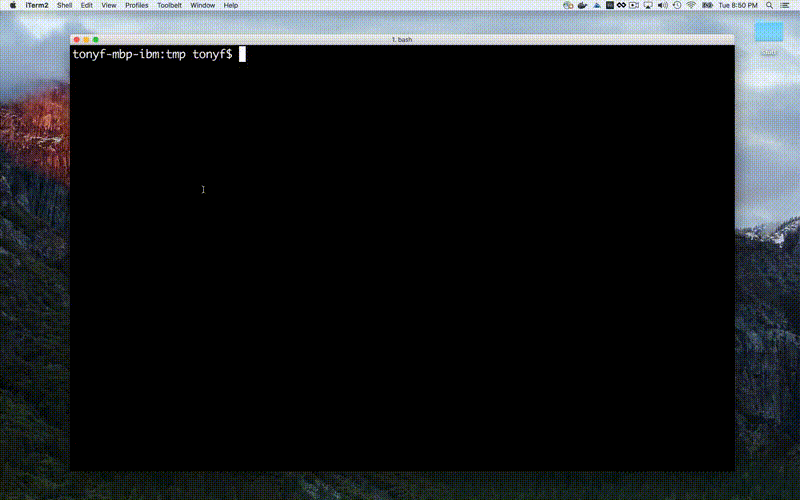

# Getting Started



**Prerequisites**: 

-Docker 1.12 (other versions should work but instructions may vary)

**Duration**: 7 minutes

This tutorial will demonstrate how you can quickly setup gateway services to secure and optimize access to backend services.

As developers, we spend a large amount of time building that innovative digital application. When your ready to integrate with  backend services, you're often met with a list of *corporate standards* on security and performance. Now, you could open up the text editor and start coding again, but security & performance are not trivial things to solve, especially at scale. This is where a developer-friendly gateway solution whose primary focus is security and performance will allow you to accelerate the time to market of your digital application.

You gotta see it to believe it, right? so let's get started.

# Development Environment

DataPower Gateways do not require a formal development environment. The majority of the configuration is performed using the Web GUI. If you need to write development artifacts, such as JavaScript or XSLT, then you can use any text editor and use Docker volume mounts to make them available to the DataPower container file system. It's the same if you want to change the configuration -- whenever you save your changes, DataPower writes files. When those files are in directories that are both Docker volumes and in version control, you win! No need to copy files around or do special builds just to try out your changes.

It's the same if you are starting with a project someone else has started. Just pull in the directories with the configuration and profit!

# Get your DataPower engine started

We love things that simply work with minimal effort. Deploying your first DataPower Gateway should be a similar experience to driving a brand new car (without the new car smell). The following steps should get you on the highway!

1. Open the docker command prompt and create a new directory called **datapower**. You will run your DataPower container from this directory `cd datapower`
2. Pull down the DataPower docker image from DockerHub. Of course this is optional, Docker is smart enough to get the image when it is run. Still, this might be a good time to familiarize yourself with what the image provides. See the [ibmcom/datapower](https://hub.docker.com/r/ibmcom/datapower/) Docker Hub page for details.

    ```
    docker pull ibmcom/datapower:latest
    ```

3. After the download completes, the DataPower image should appear in your registry

    ```
    REPOSITORY               TAG                 IMAGE ID            CREATED             SIZE
    ibmcom/datapower         latest              62ce04e36704        4 days ago          852.3 MB
    ```

4. Start the container for the first time with the command below:

    ```
    docker run -it \
      -v $PWD/config:/drouter/config \
      -v $PWD/local:/drouter/local \
      -e DATAPOWER_ACCEPT_LICENSE=true \
      -e DATAPOWER_INTERACTIVE=true \
      -p 9090:9090 \
      -p 9022:22 \
      -p 5554:5554 \
      -p 8000-8010:8000-8010 \
      --name idg \
      ibmcom/datapower
    ```

    **Note:** 
    * **Ports:** Expose ports on the host system using (_-p nn:nn_) or let Docker choose the ports (_-p nn_). If you're running multiple containers on the same host system, you should let Docker choose the ports for you.
    * **/drouter/config** is the location where DataPower will persist the configuration using an easy to read and editable format.
    * **/drouter/local** is used to store source files such as JavaScript (GatewayScript), XSLT, key, certificates and so on.
    * **DATAPOWER_INTERACTIVE=true** prompts for login to the DataPower CLI on stdin and must be used with -it. This intermixes log output, disable DATAPOWER_LOG_STDOUT if not desired.

5. Login to the CLI to complete the initial setup, default username is `admin` and also password is `admin`
6. Enable the Web GUI - this will be your primary development interface
    ```
    configure; web-mgmt 0 9090;
    ```
7. Hooray! You have completed the initial setup. Open a Web browser to `https://localhost:9090` and login to the Web GUI using the username `admin` and password `admin`.
**Note**: If your docker machine is not running on localhost, enter the command `docker-machine ip` to find the host ip address.  
8. Make a note of the directories created when you run the container. These directories are mounted from the container file system to your local file system. Any edits from your workstation are picked up immediately.
```
$ ls
config	local 
```

# Summary

In this section, you pulled down the latest DataPower Docker image and started the DataPower container. You performed some basic configuration to enable the Web GUI.

**Next Step**: [Experience the CLI and WebUI](experience-cli-webgui.md)