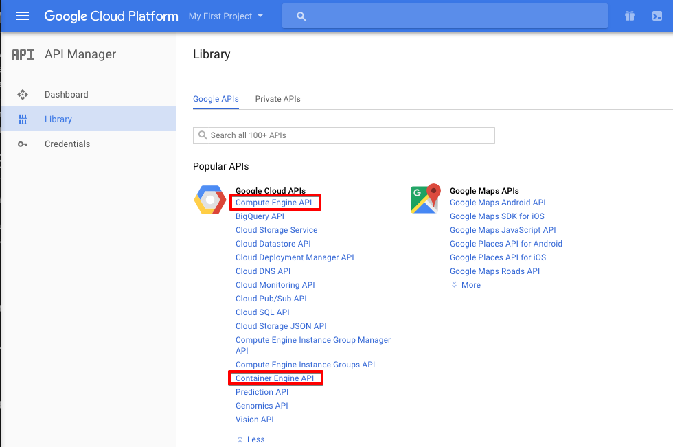
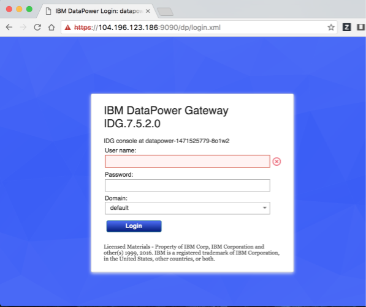

# Getting Started with DataPower and Google Container Engine (GKE)
This tutorial provides a walkthrough on the basics of getting up and running with DataPower in Kubernetes, 
a robust, production-ready orchestrator for Docker containers.

By building up from the core concepts of how applications are deployed and manged in Kubernetes we hope to
build the foundation for more advanced topics such as application configuration, service discovery, scaling,
update rollouts, and monitoring.

This tutorial uses the Google Container Engine to provide a hosted Kubernetes environment.
# Before We Begin

### Create  Google Cloud Platform (GCP) account
In order to best follow along with this tutorial, you will want access to a Google Cloud Platform account.
You can use an existing account or sign up for a free trial 
[here](https://console.cloud.google.com/freetrial "Create a Google Cloud Platform account").

### Create a Project
You may use the default project, an existing project, or create a new one as described
 [here](https://support.google.com/cloud/answer/6251787 "Create a GCP project").

### Enable Cloud resources and Cloud Shell
You will need to enable the following in the [Google API Console](https://console.developers.google.com/)
* __Compute Engine API__
* __Container Engine API__

And familiarize yourself with the Google Cloud Shell which we will use to manage our
Google Cloud Platform resources. You can find a getting started for the Google Cloud Shell 
[here](https://cloud.google.com/shell/docs/quickstarta "Google Cloud Shell Getting Started").
Once ready, head over to your project page in the Google Cloud Platform web console and
start a Google Cloud Shell session.


To avoid having to specify the --zone flag when required, you can set the region with:
    
```bash
$ gcloud config set compute/zone <zone>
```
To see valid choices for `<zone>`, run:
```bash
$ gcloud compute zones list
```

### Get the Source Code

```bash
$ git clone https://github.com/ibm-datapower/datapower-tutorials.git
$ cd datapower-tutorials/using-datapower-in-kubernetes/
```

## Tools we will use
* Docker
    * We use Docker to package, distribute and run 
    * https://www.docker.com

* IBM DataPower Geteway for Docker
    * Available as a Docker image in DockerHub
    * https://hub.docker.com/r/ibmcom/datapower/
    * https://developer.ibm.com/datapower/

* Kubernetes
    * Handle the heavy lifting of orchestrating our application
    * http://kubernetes.io

* Google Container Engine (GKE)
    * A hosted Kubernetes service
    * https://cloud.google.com/container-engine

* Google Cloud Shell
    * A shell environment for managing Google Cloud Platform resources
    * https://cloud.google.com/shell/docs/


#  Introduction to Kubernetes

## Setting Up a Kubernetes cluster with GKE

GKE provides a hosted Kubernetes service that can be customized. We will leverage Kubernetes to handle the complexity 
associated with orchestrating application containers.

To provision a GKE cluser, open up your project in Google Cloud Platform and start an instance of the Google Cloud Shell.
Next, run the following command to create a GKE cluster of 3 nodes for use in this tutorial:

```bash
$ gcloud container clusters create k8s-cluster
```

This might take a couple of minutes.

With our cluster up and running, we are now ready to run containers. 


## Introduction to Pods

In Kubernetes, all containers run in what's called a pod. A pod represents a logical application composed of co-located 
and co-scheduled containers, shared storage, and certain shared namespaces. Pods, not containers, are the smallest deployable artifact in Kubernetes.

To run a pod directly, we can, for example, run a DataPower container with:

```bash
$ kubectl run --stdin --tty datapower --image=ibmcom/datapower:latest --env="DATAPOWER_ACCEPT_LICENSE=true" --env="DATAPOWER_INTERACTIVE=true"

```

This will automatically create a default Kubernetes _deployment_ , which is a Kubernetes construct that lets you declare the desired state of
your application and is used to update your pods or replica sets to try to match the current state of your application to that of the desired state.
You can specify deployments, pods, services, replica sets, etc. declaratively in Kubernetes by writing a
corresponding configuration file.

In a separate Google Cloud Shell session, we can run `$ kubectl describe deployments` to show the details
 of the *datapower* deployment we just created.
 
 

Don't worry if not everything from the output makes sense at this point, the key takeaway here is that we can use the `describe` command to 
show the details of various Kubernetes objects as we will soon see. Additionally, note the section titled "NewReplicaSet" which lists the replica set used by our deployment.
We can see the details of our replica sets by using the `$ kubectl describe replicasets`.


As we can see in the section "Replicas", this replica set describes our current state of "1 current" running pod
and our desired state of "1 desired" running pod.

Similarly, we can run the `$ kubectl get pods` command to view the running datapower pod. 


To demonstrate the role of replica sets, lets manually delete the datapower pod.
To do this, we run: 

```bash
$ kubectl delete pods <pod_name>
```

where <pod_name> is the name of the pod as listed in `$kubectl get pods`.

We expect the replica set to note that change of state, our datapower pod being deleted, and promptly start a new pod for us running our datapower image.
To ensure this, we check `$ kubectl get pods` again which shows a new pod (note the new name) running our datapower image.
We can can also see this change in the event output of our replica set.

```bash
$ kubectl describe replicasets
```

Lastly, our first Google Cloud Session will also show our previous interactive session with the container has now
been terminated since we issued a deletion of the pod. To reattach to the new container created by the replica set,
we can issue:

```bash
$ kubectl attach <pod_name> --container="datapower" --stdin --tty
```

And log in to datapower using the default user "admin" and "admin" password.

Once you are done you can delete the deployment as we will not make further use of it in this tutorial.

# Configuration

One best practice is to separate your application code from your configuration. To this end,
Kubernetes provides a `ConfigMap` resource as of version 1.2.
A ConfigMap is a flexible object for providing your application with non-secret configuration data. The data
is presented as key-value pairs and can represent cli arguments, environment variables, and files in a mounted volume.

Let's create a ConfigMap from our datapower/auto-startup.cfg file which looks like this:

```
top; co

web-mgmt
    admin enabled
    port 9090
exit
```

To create the ConfigMap we simply type:

`$ kubectl create configmap datapower-config --from-file=datapower/auto-startup.cfg`

And to get more details about the ConfigMap we just created, we can type:

`$ kubectl describe configmap datapower-config`

We are now ready to consume the `datapower-config` ConfigMap in a deployment.


# Deploying Applications

For pretty much any non-trivial application deploymentm, we want to have a more reproducible way to define,
compose and deploy our application than issuing manual commands. Therefore, a best practice is to define
our application using *Deployments*. As mentioned earlier, a *deployment* will ensure that the specified
number of pod "replicas" are running at any given time. Below is the sample *deployment* YAML we use for this tutorial:

```
apiVersion: extensions/v1beta1
kind: Deployment
metadata:
  name: datapower
spec:
  replicas: 1
  template:
    metadata:
      labels:
        app: datapower
        track: stable
    spec:
      containers:
      - name: datapower
        image: "ibmcom/datapower:latest"        
        ports:
        - name: web-mgmt
          containerPort: 9090
        volumeMounts:
        - name: config-volume
          mountPath: /drouter/config
    volumes:
    - name: config-volume
        configMap:
            name: datapower-config    
```

Note that we use the `datapower-config` ConfigMap as a `volumes` parameter and mount it in the `volumeMounts` section.
The `mountPath: /drouter/config` is special in this case because DataPower will automatically execute a config file named
*auto-startup.cfg* if found in the */drouter/config* directory.

# Exposing Application to the Internet

We can expose the web-mgmt service we enabled through our `datapower-config` ConfigMap by running:

`$ kubectl expose deployment datapower --target-port=9090 --type=LoadBalancer`

This will create a Kubernetes *Service* that we can use to get the external IP and port we just exposed. To view it, run:

`$ kubectl get service datapower`


Which might take a minute or two to populate the external IP. Meanwhile, we also make sure that traffic from 
external IPs is allowed by opening a firewall traffic rule on port 9090 as follows:

`$ gcloud compute firewall-rules create datapower-web-mgmt --allow=tcp:9090`

We should now be able to access our web-mgmt service from the public internet.



Success!

# Cleaning it Up

In order to prevent incurring charges in Google Cloud Platform when not using our cluster we will
want to delete the Kubernetes cluster we created earlier. In a Google Cloud Shell session, type:

```bash
$ gcloud container clusters delete k8s-cluster
```

# Conclusion

We hope this introduction to running DataPower in Kubernetes was helpful in building a foundation 
that you can use when proceeding to build more complex applications that follow all the industry best-practices.

From here, we are ready to explore more advanced topics. Some example next steps include:
* Services provisioning and discovery
* Scaling microservices in your application
* Managing secrets in Kubernetes
* Update rollouts
* Application health checks and monitoring

Thank you and please let us know what you think by commenting or submitting your own pull request 
in our [GitHub repo](https://github.com/ibm-datapower/datapower-tutorials)